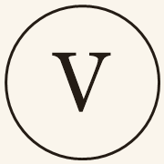

  

<h1 align="center">ALDARA</h1>

<strong>Bisutería artesanal que une culturas — Puerto Almenara</strong>

---

ALDARA es una marca de bisutería inventada para este proyecto: piezas hechas a mano, inspiradas en la unión entre Venezuela y Colombia, con un taller ficticio en Puerto Almenara, España. Todo el catálogo, los precios, la historia de marca y los datos de contacto son de ejemplo — pensados para sostenerse como una tienda real de principio a fin, no como una maqueta estática.

Este repositorio es privado. Este README explica qué es el proyecto y cómo está construido, no cómo desplegarlo.

## Una tienda, no una maqueta

ALDARA es la experiencia completa de una joyería online de gama alta: desde el primer vistazo al catálogo hasta el momento en que la pieza llega envuelta a casa.

Cada colección tiene su propia historia. Cada pieza, su ficha con acabados, materiales y cómo combinarla. El Buscador de Regalos guía a quien no sabe qué elegir. El Charm Studio y el Style Lab dejan que cada clienta arme su propia combinación y la vea antes de comprarla. El Joyero Digital guarda las piezas de cada usuaria como una colección personal, con el Pasaporte de cada joya contando su origen. Las historias de regalo privadas convierten una compra en un mensaje que solo esa persona verá.

Y todo lo que rodea a la compra está pensado igual de a fondo: cuentas con sesión real, seguimiento de pedidos, reparaciones, devoluciones, un Club de fidelidad, tarjetas regalo — la parte que la mayoría de demos se salta.

## Diseño

Paleta cálida (marfil, arena, dorado, terracota) inspirada en el oficio artesanal, con modo claro y oscuro cuidados por igual. Tipografía editorial (Cormorant Garamond) para los titulares, Montserrat para todo lo demás. Composición fotográfica real donde ya existe material, y una identidad visual generativa propia — nunca un placeholder roto — donde todavía no la hay.

## Stack

Next.js + React + TypeScript, Tailwind CSS v4, sin dependencias de UI externas. Verificado con Playwright contra build de producción real, no contra un servidor de desarrollo.

---

Contributors: [alvaroferrer1](https://github.com/alvaroferrer1)
