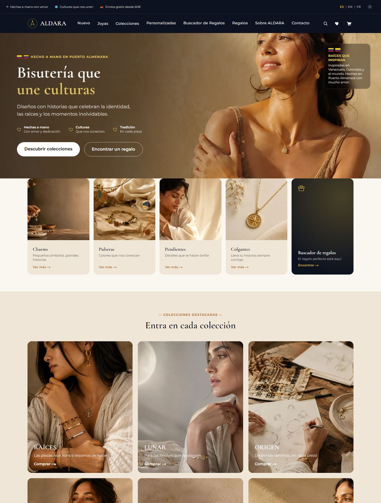
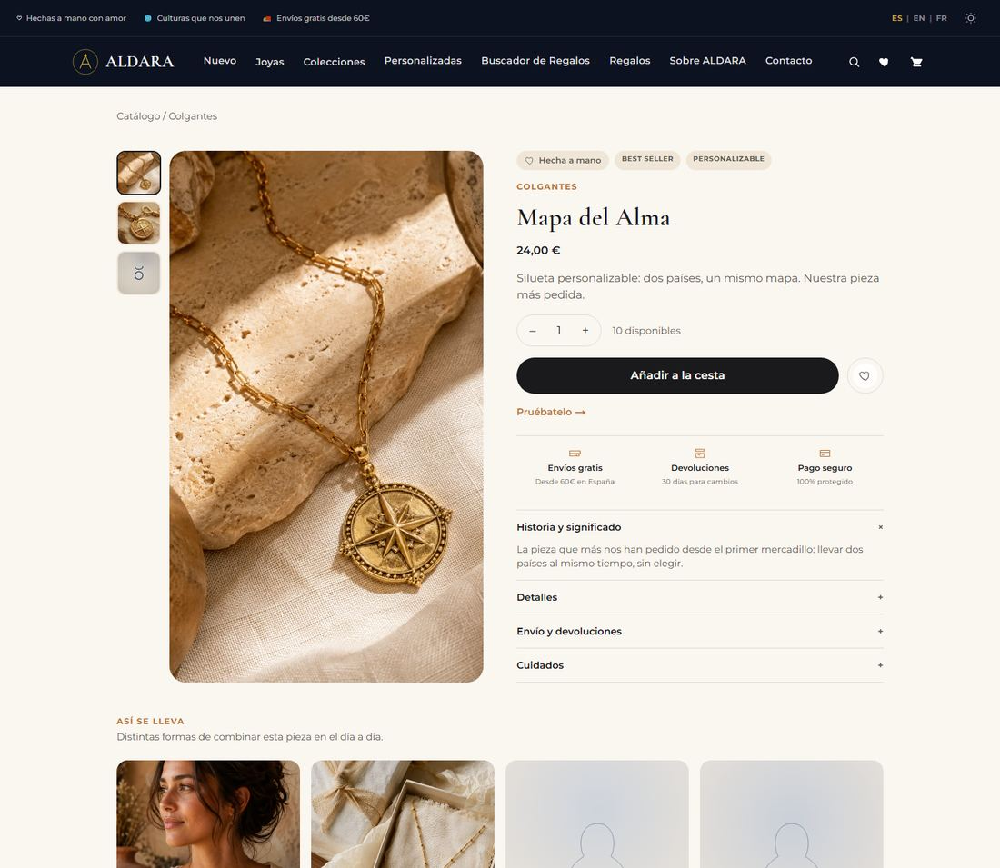
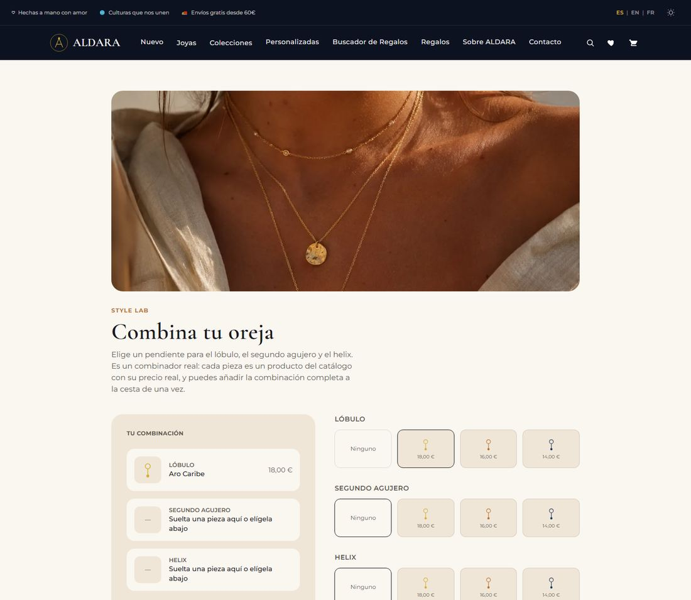

  

<h1 align="center">ALDARA</h1>

<strong>Bisutería artesanal que une culturas — Puerto Almenara</strong>

---

ALDARA es una marca de bisutería inventada para este proyecto: piezas hechas a mano, inspiradas en la unión entre Venezuela y Colombia, con un taller ficticio en Puerto Almenara, España. Todo el catálogo, los precios, la historia de marca y los datos de contacto son de ejemplo — pensados para sostenerse como una tienda real de principio a fin, no como una maqueta estática.

Este repositorio es privado. Este README explica qué es el proyecto y cómo está construido, no cómo desplegarlo.

 

  

Cada colección tiene su fotografía y su historia propia. Cada pieza, su ficha con macro real, cómo se lleva y con qué combina.

  

El Style Lab deja que cada clienta arme su propia combinación pieza a pieza, con precio real, y la añada a la cesta de una vez.

  

## Todo lo que hay detrás de la compra

No es solo un catálogo bonito. Buscador de Regalos, Charm Studio, Joyero Digital con el Pasaporte de cada pieza, Club de fidelidad, tarjetas regalo, historias de regalo privadas, cuentas con sesión real, seguimiento de pedidos, reparaciones, devoluciones — la parte que la mayoría de demos se salta.

## Diseño

Paleta cálida (marfil, arena, dorado, terracota), modo claro y oscuro cuidados por igual, tipografía editorial (Cormorant Garamond + Montserrat). Composición fotográfica real donde ya existe material, e identidad visual generativa propia —nunca un hueco roto— donde todavía no la hay.

## Stack

Next.js + React + TypeScript, Tailwind CSS v4, sin dependencias de UI externas. Verificado con Playwright contra build de producción real, no contra un servidor de desarrollo.

---

Contributors: [alvaroferrer1](https://github.com/alvaroferrer1)
